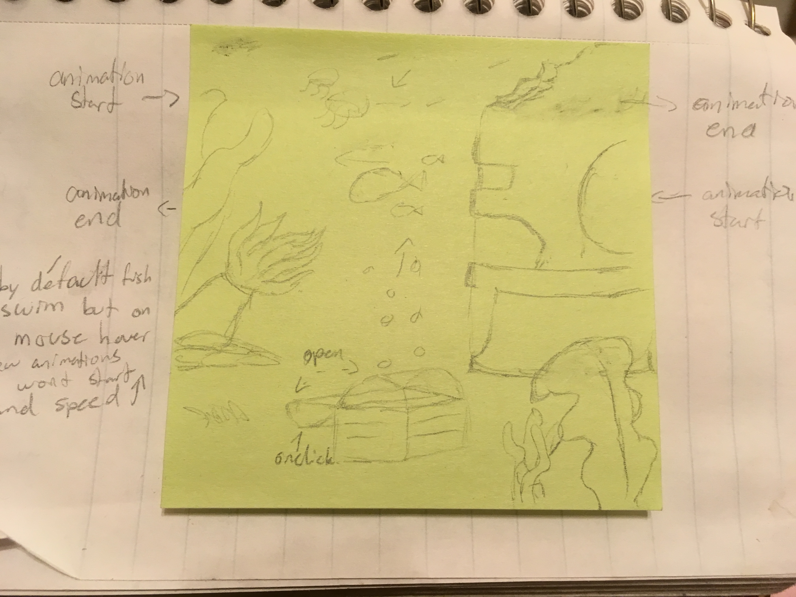

# dotw-final-project

The aim of this project is to create an immersive environmental experience of a fictional world. The three drawings will be of distinct landscapes or scenes, each with clickable and interactive elements that trigger animations. The navigation between pages will be handled by a symbol that acts as a transition between each page.

The first page will be an undersea scene. There will be a base background rasterized image, with a few transparent elements such as, some sea creatures swimming across the screen horizontally and a treasure chest like one you might find in an aquarium. The aim for this page is to have by default the animated sea creatures swimming back and forth on the screen but on mouse hover, the creatures swim away and away outside of the boundary of the entire image. This can be accomplished using two different javascript animations triggered by DOM events. The chest when clicked, will open up and reveal bubbles. This will be accomplished by using a DOM event to trigger an animation both opens the chest and reveals the invisible element of a transparent floating bubbles gif.

The second page will be a land scene. Much like the previous scene, this page will be built upon a base rasterized image with DOM events triggering elements of animated animal gifs.

The third page will be a sky scene featuring moving rasterized clouds images, a Laputa vector graphic of my own design, as well as audio. To simulate time passing, the solid background color will change from a light blue to a dark blue in a time based looping animation. Clicking on the Laputa vector will cause it to change colors or exhibit a glow-like quality.

------

